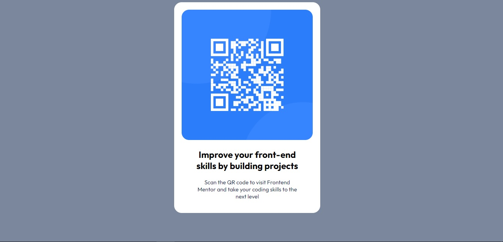

# Frontend Mentor - QR code component solution

This is a solution to the [QR code component challenge on Frontend Mentor](https://www.frontendmentor.io/challenges/qr-code-component-iux_sIO_H). Frontend Mentor challenges help you improve your coding skills by building realistic projects. 

## Overview

### Screenshot

### Links

- Solution URL: [Add solution URL here](https://qr-code-component-main-byboris.netlify.app/)
- Live Site URL: [Add live site URL here](https://your-live-site-url.com)

## My process

### Built with

- Semantic HTML5 markup
- CSS custom properties

### What I learned

I learned colors of CSS and Media querys.

### Useful resources

- [Media Querys](https://www.w3schools.com/css/css3_mediaqueries_ex.asp) - I understand some media-querys.
- [CSS reference](https://cssreference.io/) - CSS reference with examples.

## Author

- Website - [Add your name here](https://www.your-site.com)
- Frontend Mentor - [@boris-calli](https://www.frontendmentor.io/profile/boris-calli)
- Twitter - [@yourusername](https://www.twitter.com/yourusername)

